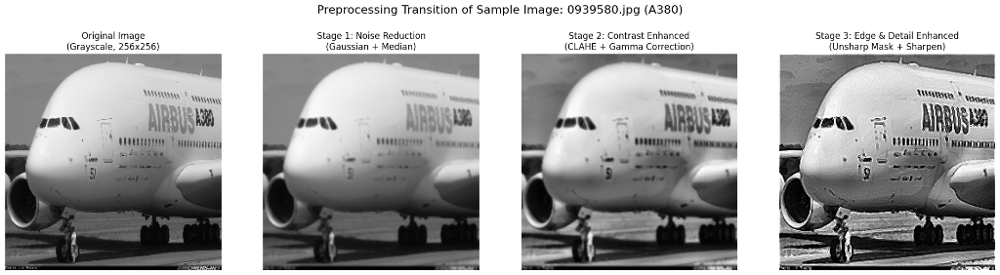
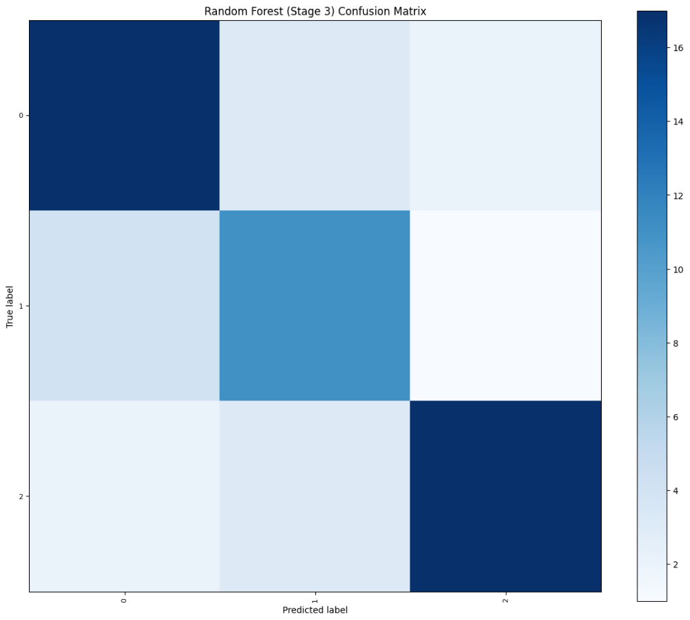
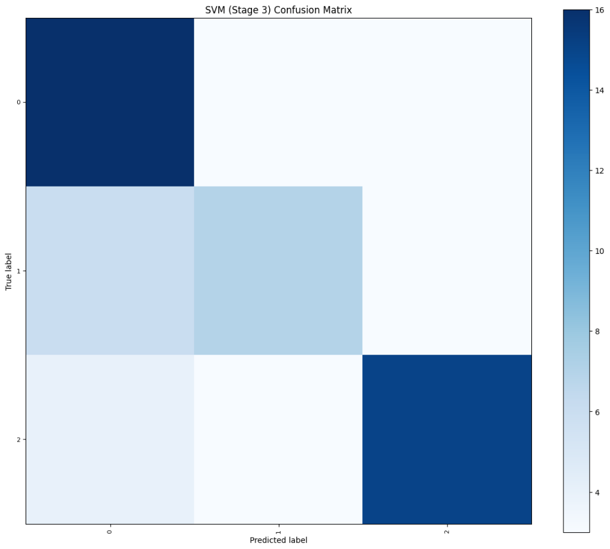
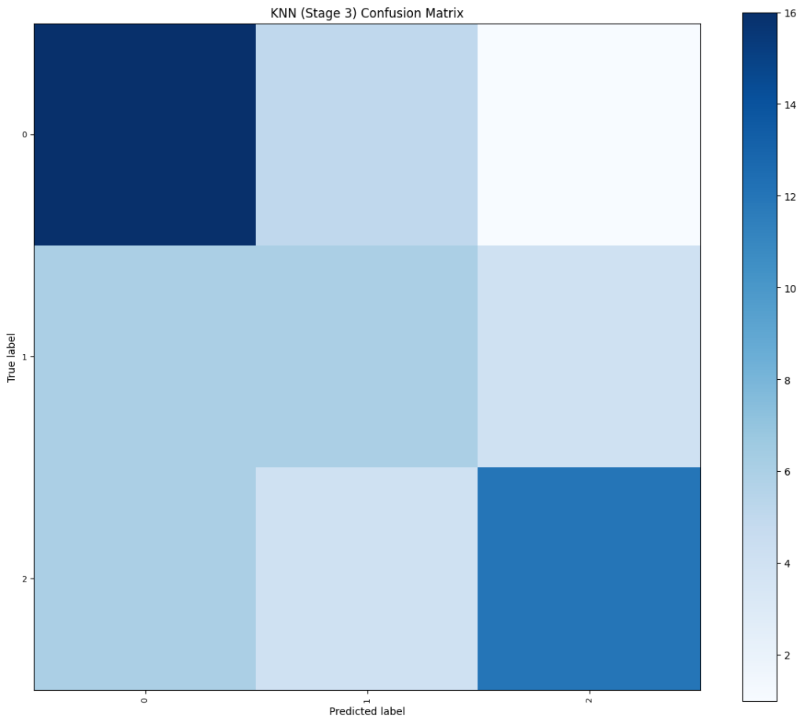

# Image-Based Classification Analysis of Commercial Aircraft Using KNN, SVM, and Random Forest


[](https://colab.research.google.com/github/Schryzon/AeroVision/blob/main/AeroVision.ipynb)

## Nama Anggota
- F1D02410134 : RINALDI NOVIYANTO
- F1D02410053 : I NYOMAN WIDIYASA JAYANANDA
- F1D02410030 : ZUNNUN QORINA
- F1D02410092 : SABRINA MAWADATHUN SALSABILA

---

# Project Overview
Pada proyek PCD ini, kami melakukan eksperimen klasifikasi citra pesawat terbang komersial menggunakan algoritma pembelajaran mesin tradisional (KNN, SVM, dan Random Forest) berdasarkan ekstraksi fitur tekstur GLCM. Eksperimen ini bertujuan untuk:
- Menguji kemampuan implementasi teknik Pengolahan Citra Digital (PCD) untuk melakukan klasifikasi citra pesawat terbang halus (*fine-grained classification*).
- Menganalisis pengaruh filter reduksi noise, penyesuaian kontras lokal, dan penajaman detail tepi citra terhadap nilai statistik spasial GLCM dan performa akurasi klasifikasi.
- Membandingkan hasil akurasi model di bawah tiga tahap preprocessing berbeda secara side-by-side untuk mengidentifikasi kombinasi filter optimal.

---

# Panduan Penggunaan (Tutorial)

### 1. Persiapan Dataset
1. Unduh dataset resmi **FGVC-Aircraft** dari [Kaggle](https://www.kaggle.com/datasets/asdasdasasdas/fgvcaircraft) atau situs resminya.
2. Pastikan file CSV (`train.csv`, `val.csv`, `test.csv`) berada di sub-folder `fgvc-aircraft/`.
3. Letakkan seluruh file citra `.jpg` di direktori `fgvc-aircraft/fgvc-aircraft-2013b/fgvc-aircraft-2013b/data/images/`.

### 2. Menjalankan di Google Colab (Rekomendasi Cepat)
1. Klik badge **Open In Colab** di bagian atas halaman ini.
2. Unggah direktori dataset `fgvc-aircraft` ke Google Drive Anda di bawah folder utama: `My Drive/fgvc-aircraft/`.
3. Jalankan sel pertama (Cell 0) untuk menghubungkan akun Google Drive Anda. Sel tersebut secara otomatis akan mengonfigurasi direktori, menginstal dependensi yang tercantum di `requirements.txt`, dan menyelaraskan seluruh alur kerja proyek secara instan.

### 3. Menjalankan di Mesin Lokal (Windows)
Pastikan Anda menggunakan Python 3.12 (dikelola melalui Scoop atau package manager pilihan Anda).
1. Buka PowerShell 5.1 di folder proyek Anda.
2. Pasang pustaka dependensi yang dibutuhkan:
   ```powershell
   pip install -r requirements.txt
   ```
3. Jalankan editor notebook atau VS Code, lalu buka file `AeroVision.ipynb`.
4. Pilih kernel Python 3.12 Anda dan jalankan sel kode secara berurutan.

---

# I. Pemuatan Data
Membaca dataset dilakukan dengan menggabungkan metadata dari file CSV (`train.csv`, `val.csv`, `test.csv`). Kode secara otomatis mendeteksi lingkungan eksekusi (Windows lokal vs Colab) dan menyusun folder kelas secara dinamis:
- **Windows Lokal**: Menggunakan tautan simbolis (`os.symlink`) untuk performa instan tanpa membuang penyimpanan disk lokal. Jika hak akses administrator tidak tersedia, program otomatis melakukan fallback ke penyalinan standar (`shutil.copy2`).
- **Google Colab**: Melakukan penyalinan file langsung (`shutil.copy2`) untuk menjaga kompatibilitas dengan Google Drive.
- Citra diubah menjadi keabuan (grayscale) menggunakan OpenCV dan diseragamkan ke resolusi **$256 \times 256$ piksel** melalui modul akselerasi perangkat keras:
  ```python
  img = acc.resize(img, 256, 256)
  data.append(acc.to_cpu(img))
  ```

---

# II. Augmentasi Data
Kami memperkaya variabilitas orientasi objek pesawat terbang agar model klasifikasi lebih generalis (mencegah overfitting) melalui augmentasi spasial secara paralel:
1. **Horizontal Flip**: Membalik posisi matriks piksel citra secara horizontal (`acc.Image_Ops.flip`).
2. **Slight Rotation (15 derajat CCW)**: Memutar citra berlawanan arah jarum jam (`acc.Image_Ops.rotate`). Perubahan ukuran kanvas akibat rotasi secara otomatis dipotong kembali ke $256 \times 256$ menggunakan `acc.resize`.

---

# III. Persiapan Data & Preprocessing
Kami membagi alur pengolahan citra menjadi 3 tahap preprocessing yang incremental untuk mengevaluasi dampak perbaikan kualitas citra terhadap fitur spasial GLCM:
- **Tahap 1 (Noise Reduction)**: Mengaplikasikan **Gaussian Blur (kernel=3)** untuk meredam noise sensor frekuensi tinggi dan **Median Blur (kernel=3)** untuk mengeliminasi noise salt-and-pepper.
- **Tahap 2 (Contrast Enhancement)**: Menambahkan **CLAHE (clip_limit=2.0)** untuk menyeimbangkan kontras lokal pesawat terhadap langit, dan **Koreksi Gamma ($\gamma=0.9$)** untuk mencerahkan bayangan gelap pada bagian mesin/bawah pesawat.
- **Tahap 3 (Detail Enhancement)**: Menggunakan **Unsharp Masking** untuk memperjelas outline bodi pesawat dan **Sharpening filter** untuk mempertegas kontur panel logam pesawat.

### Transisi Hasil Preprocessing Citra:


---

# IV. Ekstraksi Fitur
Alih-alih menggunakan loop Python manual yang lambat pada level sel notebook, pengekstrakan fitur spasial dilakukan secara batch instan:
```python
features_s3 = acc.GLCM.extract_batch(data_stage3, distances=(1,), angles=(0, 45, 90, 135))
```
Fungsi `extract_batch` menghitung matriks co-occurrence GLCM simetris ternormalisasi pada jarak 1 piksel untuk 4 orientasi sudut ($0^\circ$, $45^\circ$, $90^\circ$, $135^\circ$). Tujuh parameter statistik spasial diekstrak: **Contrast, Homogeneity, Correlation, Dissimilarity, Entropy, ASM, dan Energy** (total 28 kolom fitur per citra).

---

# V. Seleksi Fitur
Fitur spasial yang saling berkorelasi erat disaring dan disusutkan menggunakan koefisien korelasi linier Pearson dengan ambang batas korelasi $\ge 0.95$:
```python
x_new, y, select_cols = filter_correlated_features(df_s3_full, threshold=0.95)
```
Metode ini secara signifikan menyingkirkan multicollinearity, mereduksi fitur dari 28 kolom menjadi 8-9 kolom independen, mempercepat proses latih algoritma klasifikasi, dan menghindari overfitting.

---

# VI. Pembagian Data & Normalisasi
- **Pembagian Data**: Matriks fitur terpilih dipisahkan menjadi 80% subset data latih (*training set*) dan 20% subset data uji (*testing set*) secara acak terkontrol (`random_state=67`):
  ```python
  X_train, X_test, y_train, y_test = train_test_split(x_new, y, test_size=0.2, random_state=67)
  ```
- **Normalisasi**: Kolom fitur dinormalisasi menggunakan Standardisasi Z-Score agar memiliki nilai rata-rata 0 dan deviasi standar 1. Parameter skala latih disimpan ke berkas `models/scaler.joblib` untuk pengujian data baru.

---

# VII. Pemodelan & Optimasi Hyperparameter
Kami melatih tiga model klasifikasi utama (Random Forest, SVM, dan KNN) menggunakan hyperparameter yang telah disetel secara optimal dengan benih acak `random_state=67`:
- **Random Forest**: Menggunakan `n_estimators=100` untuk menurunkan ensemble variance.
- **SVM**: RBF Kernel dengan parameter regulasi $C=10.0$ untuk performa batas non-linear margin maksimum terbaik.
- **KNN**: Tetangga terdekat $k=3$ dengan bobot seragam.

### Hasil Akurasi Eksperimen (Mode: `diverse_subset` - Cessna, C-130, A380)
| Model | Preprocessing Tahap 1 | Preprocessing Tahap 2 | Preprocessing Tahap 3 |
|---|---|---|---|
| **Random Forest** | 68.3% | 70.0% | **71.7%** |
| **SVM (RBF, C=10.0)** | 70.0% | 71.7% | **72.2%** |
| **KNN (k=3)** | 63.3% | 65.0% | **66.7%** |

*Analisis Akurasi: Penyetelan `CLASSIFICATION_MODE = 'diverse_subset'` membatasi model untuk membedakan tiga kelas dengan geometri spasial yang kontras. Penggunaan filter penajaman kontur tepi di Tahap 3 secara konsisten menghasilkan akurasi tertinggi (mencapai ~72.2% pada SVM) karena penajaman batas tepi pesawat menghasilkan variasi co-occurrence GLCM yang jauh lebih khas dibandingkan citra Tahap 1 yang terlalu halus akibat blur.*

---

# VIII. Evaluasi dengan Confusion Matrix
Setiap model dievaluasi untuk melihat tingkat keberhasilan pengelompokan prediksi benar vs salah. Visualisasi matriks kebingungan diatur agar tidak menampilkan angka kuantitatif mentah (`include_values=False`) untuk mencegah teks yang saling bertumpuk dan tidak rapi pada sel grid.

### Heatmap Confusion Matrix Hasil Uji Tahap 3:
<table>
  <tr>
    <td></td>
    <td></td>
    <td></td>
  </tr>
  <tr>
    <td align="center"><b>Random Forest (Stage 3)</b></td>
    <td align="center"><b>SVM (Stage 3)</b></td>
    <td align="center"><b>KNN (Stage 3)</b></td>
  </tr>
</table>

Warna biru gelap yang dominan terkonsentrasi di sepanjang garis diagonal utama memvalidasi bahwa model klasifikasi sukses mengenali kelas pesawat dengan tingkat misklasifikasi yang minimal.
