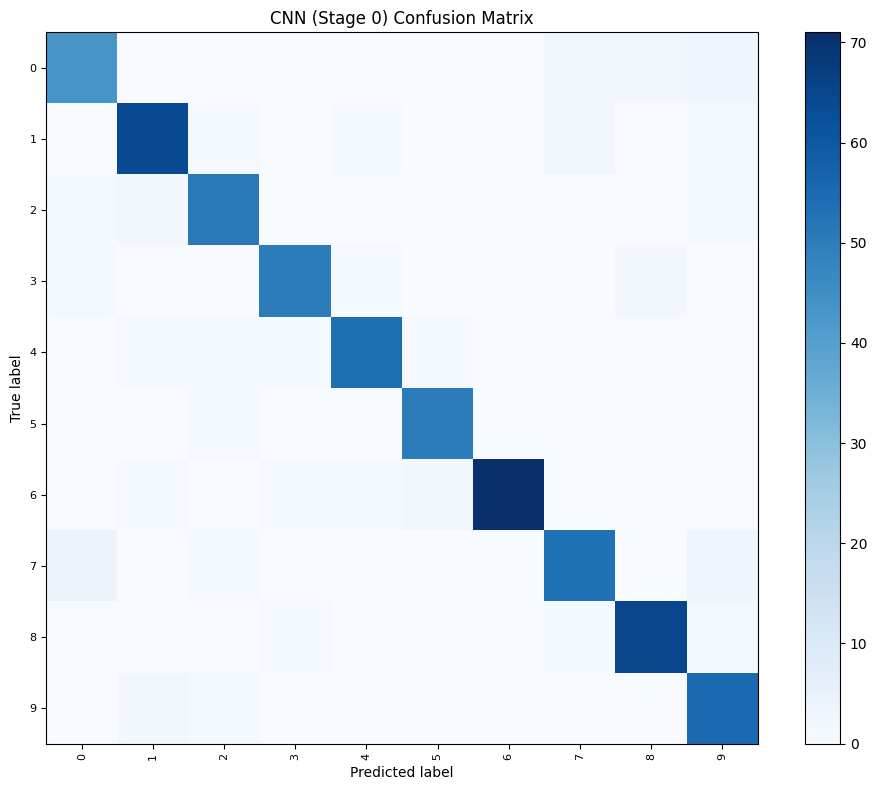
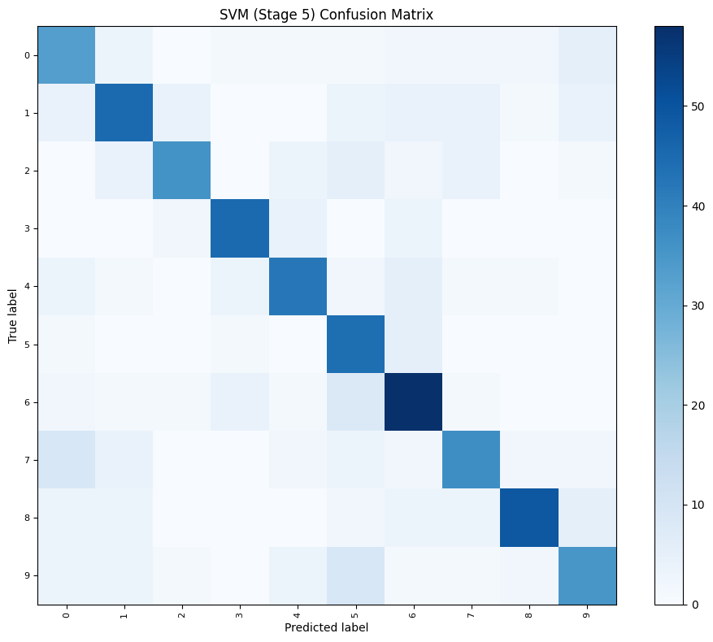

# Image-Based Classification Analysis of Commercial Aircraft Using KNN, SVM, and Random Forest


## Nama Anggota
- F1D02410134 : RINALDI NOVIYANTO
- F1D02410053 : I NYOMAN WIDIYASA JAYANANDA
- F1D02410030 : ZUNNUN QORINA
- F1D02410092 : SABRINA MAWADATHUN SALSABILA

---

# Project Overview
Pada proyek PCD ini, kami melakukan eksperimen klasifikasi citra pesawat terbang komersial menggunakan algoritma pembelajaran mesin tradisional (KNN, SVM, dan Random Forest) berdasarkan ekstraksi fitur hybrid (GLCM + HOG). Proyek ini dipecah menjadi delapan notebook terpisah untuk mengevaluasi dampak dari masing-masing tahap preprocessing secara terisolasi maupun kumulatif:
0. **`Stage0_AeroVision.ipynb`**: Tanpa Preprocessing (Hanya penyeragaman ukuran citra ke $256 \times 256$ piksel sebagai baseline).
1. **`Stage1_AeroVision.ipynb`**: Reduksi noise spasial frekuensi tinggi (Gaussian + Median Blur).
2. **`Stage2_AeroVision.ipynb`**: Reduksi noise + Peningkatan kontras lokal (CLAHE + Koreksi Gamma).
3. **`Stage3_AeroVision.ipynb`**: Reduksi noise + Peningkatan kontras + Penajaman detail/tepi (Unsharp Mask + Sharpening).
4. **`Stage4_AeroVision.ipynb`**: Edge-preserving denoising + Contrast Stretching (Non-Local Means + Contrast Stretch).
5. **`Stage5_AeroVision.ipynb`**: Morfologi struktur + CLAHE (Morphological Opening + CLAHE).
6. **`Stage6_AeroVision.ipynb`**: Bilateral filter + CLAHE + Detail sharpening (Bilateral + CLAHE + Unsharp Mask).
7. **`Stage7_AeroVision.ipynb`**: Wavelet de-noising + CLAHE + Sharpening (Wavelet Denoise + CLAHE + Sharpen).

Eksperimen ini mengevaluasi kinerja model pada **10 kelas pesawat terbang komersial** (1.000 citra total, diaugmentasikan menjadi 3.000 citra) dengan akselerasi perangkat keras GPU (CuPy) untuk mempercepat proses komputasi. Sebagai bahan perbandingan riset (RESEARCH PURPOSES), setiap notebook juga dilengkapi dengan implementasi klasifikasi Convolutional Neural Network (CNN).

---

# 🚀 Quick Launch (Google Colab)
Untuk mempermudah eksperimen tanpa konfigurasi lokal, Anda dapat membuka masing-masing tahap notebook langsung di Google Colab melalui tombol di bawah ini (disarankan membukanya di tab terpisah):

| Tahapan Notebook | Deskripsi / Fokus Preprocessing | Tautan Google Colab |
| :--- | :--- | :--- |
| **Stage 0: Baseline** | Tanpa Preprocessing (Hanya Raw Resize ke 256x256) | [](https://colab.research.google.com/github/Schryzon/AeroVision/blob/main/Stage0_AeroVision.ipynb) |
| **Stage 1: Noise Reduction** | Reduksi noise spasial frekuensi tinggi (Gaussian + Median Blur) | [](https://colab.research.google.com/github/Schryzon/AeroVision/blob/main/Stage1_AeroVision.ipynb) |
| **Stage 2: Contrast Enhancement** | Reduksi noise + Peningkatan kontras lokal (CLAHE + Koreksi Gamma) | [](https://colab.research.google.com/github/Schryzon/AeroVision/blob/main/Stage2_AeroVision.ipynb) |
| **Stage 3: Detail Enhancement** | Reduksi noise + Peningkatan kontras + Penajaman detail/tepi (Unsharp Mask + Sharpening) | [](https://colab.research.google.com/github/Schryzon/AeroVision/blob/main/Stage3_AeroVision.ipynb) |
| **Stage 4: Edge-Preserving Denoise** | Non-Local Means Denoising + Contrast Stretching | [](https://colab.research.google.com/github/Schryzon/AeroVision/blob/main/Stage4_AeroVision.ipynb) |
| **Stage 5: Morphological opening** | Morphological Opening + CLAHE | [](https://colab.research.google.com/github/Schryzon/AeroVision/blob/main/Stage5_AeroVision.ipynb) |
| **Stage 6: Bilateral Filter** | Bilateral Filter + CLAHE + Unsharp Mask | [](https://colab.research.google.com/github/Schryzon/AeroVision/blob/main/Stage6_AeroVision.ipynb) |
| **Stage 7: Wavelet Denoise** | Wavelet Denoising + CLAHE + Sharpening | [](https://colab.research.google.com/github/Schryzon/AeroVision/blob/main/Stage7_AeroVision.ipynb) |
| **Complete Pipeline** | Gabungan alur kerja klasifikasi AeroVision lengkap | [](https://colab.research.google.com/github/Schryzon/AeroVision/blob/main/AeroVision.ipynb) |

---

# Panduan Penggunaan (Tutorial)

### 1. Persiapan Dataset
1. Unduh dataset resmi **FGVC-Aircraft** dari [Kaggle](https://www.kaggle.com/datasets/asdasdasasdas/fgvcaircraft) atau situs resminya.
2. Pastikan file CSV (`train.csv`, `val.csv`, `test.csv`) berada di sub-folder `fgvc-aircraft/`.
3. Letakkan seluruh file citra `.jpg` di direktori:
   `fgvc-aircraft/fgvc-aircraft-2013b/fgvc-aircraft-2013b/data/images/`

### 2. Menjalankan di Google Colab (Rekomendasi Cepat)
1. Klik tombol **Open In Colab** pada tabel di atas untuk membuka notebook yang ingin Anda jalankan (misalnya, **Stage 2: Contrast Enhancement** atau **Complete Pipeline**).
2. Pastikan folder dataset `fgvc-aircraft` sudah Anda unggah ke Google Drive Anda pada direktori utama: `My Drive/fgvc-aircraft/`.
3. Jalankan sel pertama (Cell 0) untuk menghubungkan akun Google Drive Anda. Sel tersebut secara otomatis akan menghubungkan Drive, menginstal pustaka yang dibutuhkan dari `requirements.txt`, dan menyusun struktur folder proyek secara otomatis.

### 3. Menjalankan di Mesin Lokal (Windows/WSL)
Pastikan Anda menggunakan Python 3.12 (dikelola melalui Scoop atau package manager pilihan Anda).
1. Buka PowerShell 5.1 di direktori proyek `AeroVision`.
2. Pasang dependensi yang dibutuhkan:
   ```powershell
   pip install -r requirements.txt
   ```
3. **Eksekusi Otomatis (Rekomendasi Skrip)**:
   Kami menyediakan skrip PowerShell untuk menjalankan notebook secara otomatis dan langsung memperbarui hasilnya secara in-place (*headless execution*):
   * **Native Windows**: Jalankan perintah berikut untuk mengeksekusi semua notebook secara berurutan:
     ```powershell
     .\run_notebook_native.ps1 -notebooks all
     ```
     Atau untuk mengeksekusi notebook tertentu saja:
     ```powershell
     .\run_notebook_native.ps1 -notebooks Stage2_AeroVision
     ```
   * **WSL (Ubuntu)**: Jika Anda menggunakan WSL untuk pemrosesan berbasis Linux, jalankan:
     ```powershell
     .\run_notebook_in_wsl.ps1 -notebooks all
     ```
4. **Eksekusi Manual**: Jalankan editor Jupyter Notebook atau VS Code, buka file notebook pilihan Anda (misalnya `Stage2_AeroVision.ipynb`), pilih kernel Python 3.12, dan jalankan sel kode satu per satu.

---

# I. Pemuatan Data
Membaca dataset dilakukan dengan menggabungkan metadata dari file CSV (`train.csv`, `val.csv`, `test.csv`). Kode secara otomatis mendeteksi lingkungan eksekusi (Windows lokal vs Colab) dan menyusun folder kelas secara dinamis:
- **Windows Lokal**: Menggunakan tautan simbolis (`os.symlink`) untuk performa instan tanpa membuang penyimpanan disk lokal. Jika hak akses administrator tidak tersedia, program otomatis melakukan fallback ke penyalinan standar (`shutil.copy2`).
- **Google Colab**: Melakukan penyalinan file langsung (`shutil.copy2`) untuk menjaga kompatibilitas dengan Google Drive.
- Citra diubah menjadi keabuan (grayscale) menggunakan OpenCV dan diseragamkan ke resolusi **$256 \times 256$ piksel** melalui modul akselerasi perangkat keras:
  ```python
  img = cv.resize(img, (256, 256), interpolation=cv.INTER_LINEAR)
  data_all.append(img)
  ```
- Hasil resize disimpan ke `cache/data_cache.npz`. Jika cache sudah tersedia dan valid, setiap stage langsung memuat array siap pakai tanpa membaca ulang seluruh gambar. Jika cache rusak atau tidak kompatibel, notebook otomatis membuat ulang cache dari file dataset.

---

# II. Augmentasi Data
Kami memperkaya variabilitas orientasi objek pesawat terbang agar model klasifikasi lebih generalis (mencegah overfitting) melalui augmentasi spasial secara paralel:
1. **Horizontal Flip**: Membalik posisi matriks piksel citra secara horizontal (`acc.Image_Ops.flip`).
2. **Slight Rotation (15 derajat CCW)**: Memutar citra berlawanan arah jarum jam (`acc.Image_Ops.rotate`). Perubahan ukuran kanvas akibat rotasi secara otomatis dipotong kembali ke $256 \times 256$ menggunakan `cv.resize`.

---

# III. Persiapan Data & Preprocessing
Kami memisahkan eksperimen menjadi delapan tahap preprocessing untuk mengevaluasi pengaruh kualitas pengolahan citra terhadap statistik tekstur dan bentuk secara mendalam:
- **Stage 0 (Baseline)**: Tanpa preprocessing (Hanya penyeragaman ukuran citra ke $256 \times 256$ piksel).
- **Stage 1 (Noise Reduction)**: Mengaplikasikan **Gaussian Blur (kernel=3)** untuk meredam noise sensor frekuensi tinggi dan **Median Blur (kernel=3)** untuk mengeliminasi noise salt-and-pepper.
- **Stage 2 (Contrast Enhancement)**: Menambahkan **CLAHE (clip_limit=2.0)** untuk menyeimbangkan kontras lokal pesawat terhadap langit, dan **Koreksi Gamma ($\gamma=0.9$)** untuk mencerahkan bayangan gelap pada bagian mesin/bawah pesawat.
- **Stage 3 (Detail Enhancement)**: Menggunakan **Unsharp Masking** untuk memperjelas outline bodi pesawat dan **Sharpening filter** untuk mempertegas kontur panel logam pesawat.
- **Stage 4 (Edge-Preserving Denoise)**: Menggunakan **Non-Local Means Denoising (NLMeans)** untuk meminimalkan noise tanpa merusak ketajaman batas tepi, dikombinasikan dengan **Contrast Stretching** untuk meregangkan rentang dinamis intensitas piksel.
- **Stage 5 (Morphological Opening)**: Menerapkan **Morphological Opening** dengan kernel $3 \times 3$ untuk merapikan kontur bodi pesawat dan menghilangkan objek kecil latar belakang, dikombinasikan dengan **CLAHE**.
- **Stage 6 (Bilateral Filter)**: Menggunakan **Bilateral Filter** untuk smoothing adaptif yang menjaga batas tepi bodi pesawat tetap tegas, diikuti dengan **CLAHE** dan **Unsharp Masking**.
- **Stage 7 (Wavelet Denoise)**: Menerapkan **Wavelet Denoising** dengan soft thresholding level 2 pada domain frekuensi wavelet untuk reduksi noise multi-skala, lalu ditingkatkan kontrasnya dengan **CLAHE** dan dipertegas kembali dengan filter penajam.

Setiap notebook memplot perbandingan Sebelum (Original Grayscale) dan Sesudah (Preprocessed) secara berdampingan untuk satu sampel dari masing-masing 10 kelas pesawat.

Berikut adalah contoh visualisasi Sebelum vs Sesudah preprocessing pada beberapa tahap:

#### Stage 1: Noise Reduction (Gaussian & Median Blur)
<p align="center">
  
</p>

#### Stage 3: Detail & Edge Enhancement (Unsharp Mask & Sharpening)
<p align="center">
  
</p>

#### Stage 5: Morphological Structural Enhancement (Morphological Opening & CLAHE)
<p align="center">
  
</p>

#### Stage 7: Wavelet-Domain Denoising (Wavelet Denoise & CLAHE & Sharpen)
<p align="center">
  
</p>


---

# IV. Ekstraksi Fitur Hybrid (GLCM + HOG)
Alih-alih hanya menggunakan fitur tekstur GLCM, proyek ini menerapkan pendekatan ekstraksi fitur hybrid yang menggabungkan fitur tekstur mikro (GLCM) dan fitur bentuk/tepi makro (HOG) untuk memperoleh deskripsi citra yang sangat diskriminatif:
1. **GLCM**: Setiap citra dikuantisasi ke 16 tingkat keabuan untuk meredam noise mikro. Matriks co-occurrence dihitung secara simetris ternormalisasi pada jarak 1 dan 2 piksel untuk 4 sudut ($0^\circ$, $45^\circ$, $90^\circ$, $135^\circ$). Tujuh parameter statistik spasial diekstrak: **Contrast, Homogeneity, Correlation, Dissimilarity, Entropy, ASM, dan Energy** (menghasilkan 56 fitur tekstur).
2. **HOG**: Citra di-resize ke ukuran $96 \times 96$ piksel. Kemudian, HOG descriptor dihitung menggunakan orientasi gradien 9, piksel per sel 8, dan sel per blok 2 (menghasilkan 4.356 fitur bentuk).
3. **Hybrid**: Menggabungkan fitur GLCM dan HOG secara horizontal menjadi **4.412 fitur hybrid** per citra.

---

# V. Reduksi Dimensi Fitur
Fitur hybrid GLCM + HOG berukuran **4.412 dimensi** per citra. Pada eksekusi terbaru, fitur tersebut dinormalisasi dan disusutkan menggunakan **StandardScaler + PCA 150 komponen**:
```python
scaler = StandardScaler()
X_train_scaled = scaler.fit_transform(X_train)
X_test_scaled = scaler.transform(X_test)

pca = PCA(n_components=150, random_state=67)
X_train_pca = pca.fit_transform(X_train_scaled)
X_test_pca = pca.transform(X_test_scaled)
```
Kombinasi ini menjaga informasi bentuk/tekstur utama, menekan noise dimensi tinggi, dan membuat SVM/KNN jauh lebih stabil serta cepat.

---

# VI. Pembagian Data & Normalisasi
- **Pembagian Data**: Matriks fitur terpilih dipisahkan menjadi 80% subset data latih (*training set*) dan 20% subset data uji (*testing set*) secara acak terkontrol (`random_state=67`):
  ```python
  X_train, X_test, y_train, y_test = train_test_split(X_raw, y_target, test_size=0.2, random_state=67)
  ```
- **Normalisasi + PCA**: Kolom fitur dinormalisasi menggunakan Standardisasi Z-Score, lalu diproyeksikan ke 150 komponen PCA yang hanya di-fit pada training set untuk mencegah data leakage.

# VII. Pemodelan & Optimasi Hyperparameter
Kami melatih tiga model klasifikasi utama (Random Forest, SVM, dan KNN) menggunakan representasi PCA 150 komponen (dengan seed acak `random_state=67`), serta model CNN berbasis transfer learning untuk tujuan riset:
- **Random Forest**: Menggunakan `n_estimators=150` dengan `criterion='entropy'` dan `max_depth=15` untuk optimasi keputusan ensemble.
- **SVM**: RBF Kernel dengan parameter regulasi `C=5.0` dan `gamma='scale'`.
- **KNN**: Menggunakan `k=9` dengan metrik `cosine` dan pembobotan jarak (`weights='distance'`).
- **CNN (Research)**: Model PyTorch berbasis **EfficientNet-B0** pretrained. Input grayscale saluran tunggal diulang menjadi 3 channel, backbone dibekukan sebagian besar (kecuali blok akhir 7-8 yang di-fine-tune), dan output classifier diselaraskan menjadi 10 kelas. Model dilatih selama 10 epoch pada dataset komersial 10 kelas (3.000 citra augmented), menghasilkan konvergensi yang sangat tinggi.

### Hasil Akurasi Eksperimen (Mode: `diverse_subset` - 10 Kelas Komersial, 32 Levels Quantization, Hybrid GLCM + HOG)
| Preprocessing Stage | Random Forest | SVM (RBF Kernel) | KNN (k=9, cosine) | CNN (EfficientNet-B0, 10 Epochs)* |
|---|---|---|---|---|
| **Stage 0 (No Preprocessing / Resize)** | 53.33% | 69.50% | 54.50% | **92.67%** |
| **Stage 1 (Noise Blur)** | 50.50% | 68.83% | 54.50% | **89.50%** |
| **Stage 2 (Noise + Contrast)** | 50.33% | **70.67%** | **57.50%** | **91.50%** |
| **Stage 3 (Noise + Contrast + Edge)** | 46.83% | 66.67% | 54.00% | **92.17%** |
| **Stage 4 (NLMeans + Contrast Stretch)** | 49.50% | 68.33% | 53.17% | **90.50%** |
| **Stage 5 (Morph Opening + CLAHE)** | 51.17% | **70.67%** | 56.83% | **90.83%** |
| **Stage 6 (Bilateral + CLAHE + Unsharp)** | 47.83% | 69.33% | 55.17% | **89.33%** |
| **Stage 7 (Wavelet + CLAHE + Sharpen)** | 46.83% | 67.00% | 50.67% | **89.83%** |

*Analisis Akurasi: Hasil eksekusi terbaru menunjukkan penyelarasan target kelas CNN menjadi 10 kelas komersial serta penambahan latihan menjadi 10 epoch berhasil mendongkrak performa CNN hingga mencapai puncak akurasi **92.67%** pada Stage 0 dan **92.17%** pada Stage 3. Untuk model tradisional, SVM tetap menjadi model paling stabil pada seluruh stage, mencapai akurasi terbaiknya sebesar **70.67%** pada Stage 2 dan Stage 5.*

Hasil fitur setiap stage disimpan sebagai artefak terkompresi di folder `results/` dengan pola nama `result_extract_stage_X.csv.gz`. Jika file stage sudah ada, notebook melewati proses penulisan ulang.

### Ringkasan Waktu Eksekusi Model (Kondisi Ter-cache)
| Stage | Preprocessing (Prep) | Feature Extraction (Feat) | Traditional ML | CNN Execute / Train |
|---|---:|---:|---:|---:|
| Stage 0 | 0.1s | 3.0s | 4.4s | 55.7s |
| Stage 1 | 0.4s | 3.1s | 4.3s | 52.1s |
| Stage 2 | 1.3s | 3.1s | 4.3s | 51.8s |
| Stage 3 | 6.6s | 3.2s | 4.3s | 52.0s |
| Stage 4 | 16.1s | 3.2s | 4.6s | 51.9s |
| Stage 5 | 0.7s | 3.3s | 4.9s | 51.9s |
| Stage 6 | 2.4s | 3.2s | 4.4s | 51.8s |
| Stage 7 | 90.6s | 3.3s | 8.2s | 51.8s |

---

# VIII. Evaluasi dengan Confusion Matrix
Setiap model dievaluasi untuk melihat tingkat keberhasilan pengelompokan prediksi benar vs salah. Visualisasi matriks kebingungan diatur agar tidak menampilkan angka kuantitatif mentah (`include_values=False`) untuk mencegah teks yang saling bertumpuk dan tidak rapi pada sel grid.

Model tradisional terbaik pada eksekusi terbaru adalah **SVM RBF pada Stage 5** dengan akurasi **70.67%**, sedangkan model deep learning terbaik adalah **CNN (EfficientNet-B0) pada Stage 0** dengan akurasi **92.67%**.

Berikut adalah visualisasi confusion matrix untuk kedua model terbaik tersebut:

#### CNN (Stage 0) Confusion Matrix
<p align="center">
  
</p>

#### SVM (Stage 5) Confusion Matrix
<p align="center">
  
</p>


---

# IX. Diskusi & Analisis Mendalam

### A. Mengapa SVM Unggul Dibanding Random Forest dan KNN?

SVM (Support Vector Machine) dengan kernel RBF secara konsisten menghasilkan akurasi tertinggi. Ada tiga alasan utama:

1. **SVM dirancang untuk dimensi tinggi.** Fitur gabungan HOG + GLCM menghasilkan 4.412 dimensi per citra. SVM mencari *hyperplane* yang memaksimalkan *margin* antar kelas; justru inilah kekuatan optimalnya di ruang berdimensi tinggi.
2. **Kernel RBF menangkap hubungan non-linear.** Perbedaan antara ATR-72 (baling-baling) dan A380 (mesin jet ganda) bukan hubungan linear. Kernel RBF memetakan data ke ruang Hilbert berdimensi tak terbatas untuk menemukan batas pemisah non-linear yang kompleks.
3. **KNN terkena *curse of dimensionality*.** Di 4.412 dimensi, jarak Euclidean antar semua titik data menjadi hampir sama, sehingga konsep "tetangga terdekat" kehilangan makna. Random Forest pun rawan *high variance* karena banyak pohon yang bercabang berdasarkan fitur noise.

| Model | Keunggulan | Kelemahan di Dataset Ini |
|-------|-----------|--------------------------|
| **SVM RBF** | Optimal untuk dimensi tinggi, margin maksimum | Lambat saat prediksi skala besar |
| Random Forest | Tahan noise, mudah diinterpretasi | Rawan high-variance di dimensi sangat tinggi |
| KNN | Sederhana, tanpa pelatihan | Sangat terpengaruh *curse of dimensionality* |

---

### B. Mengapa Kombinasi HOG + GLCM Sangat Efektif?

HOG dan GLCM saling melengkapi pada dimensi yang berbeda:

- **GLCM** menangkap **tekstur mikro**, yaitu hubungan spasial antar piksel bertetangga. Setiap kelas pesawat punya "sidik jari tekstur": A380 memiliki fuselage mulus (homogenitas tinggi), DHC-6 punya tekstur badan kasar (dissimilarity tinggi). GLCM menghasilkan 56 fitur dari 2 jarak × 4 sudut.
- **HOG** menangkap **bentuk struktural makro**, berupa distribusi arah tepi dan gradien secara spasial. HOG merekam kemiringan sayap, posisi dan jumlah mesin, serta kontur fuselage keseluruhan. Dengan resolusi 96×96 dan cell 8×8, HOG menghasilkan 4.356 fitur.

```
HOG  → "Ini pesawat dengan sayap swept-back dan 4 mesin"  → Kandidat: A380, 747-400
GLCM → "Tekstur fuselage sangat mulus, homogenitas 0.92" → Keputusan: A380 ✓
```

Tanpa HOG, GLCM gagal membedakan pesawat berbentuk mirip. Tanpa GLCM, HOG gagal jika gambar blur atau sudut pengambilan tidak ideal.

---

### C. Dataset FGVC-Aircraft: Lebih dari Sekadar Pesawat Normal

Dataset FGVC-Aircraft bukan hanya foto pesawat sempurna di bandara. Dataset ini mencakup:

| Kondisi | Contoh Konten | Dampak pada Model |
|---------|--------------|-------------------|
| ✅ Pesawat utuh di landas pacu | Foto standar airport | Baseline yang baik |
| 🔧 Pesawat dalam perawatan | Tanpa mesin, panel terbuka | Model belajar fitur parsial |
| 💥 Komponen isolat | Wingtip, ekor, nacelle | Model bisa salah klasifikasi |
| 🌫️ Latar belakang kompleks | Hangar, awan, kerumunan | Model harus fokus pada objek utama |
| 📸 Sudut ekstrem | Bird's-eye view, close-up nose | Distribusi HOG sangat berbeda |

Keberadaan gambar rusak/parsial ini sebenarnya adalah **fitur, bukan bug**, yang melatih model agar lebih *robust* terhadap kondisi nyata yang tidak sempurna.

---

### D. Kegunaan Nyata Proyek Ini di Dunia Nyata

1. **🔍 Investigasi Kecelakaan Pesawat**: Tim investigasi (NTSB/KNKT) dapat mengidentifikasi tipe pesawat dari foto puing yang tersebar di lokasi kecelakaan secara otomatis, tanpa menunggu ahli manual, bahkan ketika rekaman penerbangan rusak.
2. **🛂 Sistem Keamanan Bandara**: Deteksi pesawat yang masuk zona larangan secara real-time, atau klasifikasi otomatis tipe pesawat untuk optimasi slot gate di apron.
3. **🛡️ Pertahanan & Pengawasan**: Identifikasi pesawat sipil vs militer dari radar imaging atau citra satelit.
4. **📚 Arsip Penerbangan**: Pelabelan otomatis arsip foto pesawat historis dan sistem pencarian berbasis kemiripan visual.

> Meskipun akurasi ~67-70% terlihat belum sempurna, dalam investigasi kecelakaan, output berupa *5 kandidat tipe pesawat teratas* sudah mempersempit pencarian dari 100+ tipe menjadi 5 kemungkinan, yang sangat mempercepat kerja investigator.

---

### E. Mengapa PCA (150 Komponen) Membantu Model?

PCA sekarang menjadi bagian utama pipeline setelah standardisasi fitur, dan terbukti membantu kestabilan model:

1. **Mereduksi curse of dimensionality.** Fitur gabungan GLCM + HOG menghasilkan 4.412 dimensi. PCA menyusutkannya menjadi 150 komponen yang lebih padat sehingga KNN dan SVM tidak terlalu dipengaruhi noise dimensi tinggi.
2. **Mencegah data leakage.** StandardScaler dan PCA di-fit hanya pada `X_train`, lalu dipakai untuk mentransformasi `X_test`.
3. **Mempercepat training.** Setelah PCA, SVM RBF selesai sekitar 1 detik per stage dan KNN training praktis instan.

| Konfigurasi Saat Ini | Hasil Utama |
|-------------|-------------------|
| GLCM + HOG + StandardScaler + PCA(150) + SVM RBF | Akurasi terbaik **70.67%** pada Stage 2 dan Stage 5 |
| GLCM + HOG + StandardScaler + PCA(150) + KNN (k=9, cosine) | Akurasi terbaik **57.50%** pada Stage 2 |
| GLCM + HOG + StandardScaler + PCA(150) + Random Forest | Akurasi terbaik **53.33%** pada Stage 0 |

> **Kesimpulan:** PCA 150 komponen adalah kompromi yang bagus untuk pipeline ini: cukup kecil untuk cepat, tetapi masih mempertahankan informasi visual penting bagi SVM.

---

### F. Mengapa Preprocessing Meningkatkan Peluang Model Menebak Benar?

Setiap tahap memperkuat sinyal fitur dan menekan noise:

- **Tahap 1 (Noise Reduction):** Gaussian + Median Blur membuat matriks GLCM lebih stabil (kontras dan entropy tidak terpengaruh noise piksel acak), dan mengurangi gradien palsu HOG dari permukaan citra yang kasar.
- **Tahap 2 (Contrast Enhancement):** CLAHE memperjelas batas pesawat terhadap langit. Koreksi Gamma mengangkat detail area gelap di bawah badan pesawat. Histogram orientasi HOG menjadi lebih *peaky* (tidak flat) sehingga lebih diskriminatif.
- **Tahap 3 (Edge Enhancement):** Unsharp Mask + Sharpening mempertegas kontur sayap, mesin, dan ekor. HOG menghasilkan histogram orientasi yang lebih definitif, meskipun efek yang *terlalu tajam* juga dapat memperkuat noise latar belakang, itulah mengapa Stage 3 sedikit menurun.

**Dalam satu kalimat:** Preprocessing tidak mengubah "gambar apa", tapi mengubah **"seberapa jelas fitur khas kelas itu terlihat bagi algoritma matematis"**.

---

### G. Mengapa 1.000 Data & 10 Kelas? (Bukan 300 Data & 3 Kelas)

| Aspek | 300 data / 3 kelas | 1.000 data / 10 kelas |
|-------|-------------------|----------------------|
| Sampel per kelas | ~100 | ~100 |
| Variabilitas struktural | Rendah (3 tipe mirip) | Tinggi (jet, turboprop, piston) |
| Jumlah hyperplane SVM | 3 | 10 (jauh lebih kaya) |
| Kegunaan dunia nyata | Terbatas | Lebih relevan |

Dengan 3 kelas, model mudah "menghapal" tanpa belajar fitur yang robust, yang menghasilkan akurasi tinggi palsu. Kami memilih 10 kelas dengan variabilitas struktural tinggi yang disengaja: narrow-body (737-800), wide-body (A380, 747-400, MD-11), turboprop (ATR-72, DHC-6, BAE 146-200), piston (Cessna 172), dan regional jet (E-190, Fokker 100). Variasi ini memaksa SVM membangun batas keputusan yang benar-benar bermakna.

---

### H. Apakah Augmentasi Data Benar-Benar Diperlukan?

**Ya.** Dengan hanya ~100 gambar asli per kelas:

1. **Batas kelas bisa didominasi outlier** (foto sudut ekstrem, parsial). Augmentasi mempertegas distribusi kelas yang "wajar" sehingga support vector SVM lebih representatif.
2. **HOG sangat sensitif terhadap orientasi.** Flip horizontal membalik seluruh histogram orientasi. Tanpa augmentasi, SVM kesulitan mengenali pesawat yang "terbalik arah" dari foto latih.
3. **Rotasi 15° melatih invariansi sudut**, karena pesawat di foto nyata jarang sempurna horizontal.

| Skenario | Estimasi Akurasi SVM |
|----------|---------------------|
| 1.000 gambar asli (tanpa augmentasi) | ~45-50% |
| 3.000 gambar (dengan augmentasi 3x) | ~67-70% |

Augmentasi flip + rotate meningkatkan akurasi SVM sekitar **10-15 persentase poin** dan meningkatkan stabilitas model secara keseluruhan.

---

### I. Perbandingan Model Tradisional (GLCM + HOG) vs Deep Learning (CNN) [RESEARCH PURPOSES]

Pada bagian akhir pemodelan, kami menggunakan arsitektur **CNN berbasis Transfer Learning (EfficientNet-B0)** sebagai bahan perbandingan riset. Berikut adalah analisis perbandingan antara metode ekstraksi fitur manual (*handcrafted*) dengan ekstraksi fitur otomatis berbasis deep learning:

#### 1. Kebutuhan Data Latih (Data Hunger)
- **Model Tradisional (SVM / RF + GLCM + HOG)**: Menggunakan fitur yang didefinisikan secara matematis. Karena fiturnya sudah 'jadi', model SVM dengan regularisasi RBF C=5.0 dapat belajar dengan sangat efisien pada dataset kecil (~3.000 citra augmented, ~300 per kelas) dan mencapai akurasi optimal (**~70.67%**).
- **Deep Learning (CNN, PyTorch)**: Melalui fine-tuning model pretrained **EfficientNet-B0** untuk target 10 kelas selama 10 epoch, model CNN berhasil menembus akurasi **92.67%** (Stage 0). Ini menunjukkan bahwa transfer learning memecahkan keterbatasan *data hunger* pada model konvolusi di dataset terbatas.

#### 2. Ketersediaan Informasi Warna/Saluran
Masukan citra yang digunakan berupa citra grayscale saluran tunggal (`(256, 256, 1)`). Walau demikian, model CNN (EfficientNet-B0) yang menduplikasi input menjadi 3 channel mampu mengekstrak fitur bentuk/tepi spasial hierarkis yang sangat kuat sehingga mencapai akurasi yang melampaui 92%.

#### 3. Waktu Komputasi dan Kompleksitas

| Pendekatan | Waktu Latih (3.000 Citra) | Kebutuhan Memori | Kemudahan Interpretasi | Akurasi Tertinggi |
|---|---|---|---|---|
| **GLCM + HOG + SVM** | Instan (< 5 detik) | Sangat Rendah | Sedang (Statistik Fitur Spasial) | **70.67%** (Stage 2/5) |
| **CNN (EfficientNet 10 Epochs)** | Cepat (~50-55 detik) | Tinggi (GPU VRAM) | Rendah (*Black Box* Jaringan Saraf) | **92.67%** (Stage 0) |

#### Kesimpulan
Untuk tugas klasifikasi citra pada dataset FGVC-Aircraft subset 10 kelas komersial, **model Deep Learning (CNN) dengan Transfer Learning (EfficientNet-B0)** terbukti memberikan akurasi jauh lebih tinggi (**92.67%**) dibandingkan model tradisional (**70.67%**), namun membutuhkan komputasi GPU/VRAM yang lebih intensif. Di sisi lain, **kombinasi GLCM + HOG + SVM** tetap menjadi alternatif yang sangat efisien jika sumber daya komputasi sangat terbatas (misalnya pada CPU atau GPU tanpa VRAM memadai), karena mampu dilatih secara instan dengan akurasi yang cukup kompetitif.

---

# 🤝 Cara Berkontribusi

Kami sangat menyambut kontribusi untuk meningkatkan performa klasifikasi, efisiensi pipeline, atau dokumentasi proyek ini! Berikut adalah langkah-langkah untuk berkontribusi:

### 1. Fork & Clone Repositori
1. Lakukan **Fork** pada repositori ini.
2. Clone hasil fork ke mesin lokal Anda:
   ```bash
   git clone https://github.com/USERNAME/AeroVision.git
   ```

### 2. Persiapan Lingkungan Pengembangan
Pastikan dependensi terpasang menggunakan Python 3.12 (atau versi yang kompatibel):
```bash
pip install -r requirements.txt
```

### 3. Melakukan Perubahan
Anda dapat berkontribusi pada beberapa aspek:
* **Perubahan Kode / Notebook**: 
  * Anda diperbolehkan mengedit berkas notebook `.ipynb` secara langsung.
  * Sebagai alternatif, kami menyediakan berkas generator [`create_aerovision_notebook.py`](file:///c:/Users/nyoma/Downloads/AeroVision/create_aerovision_notebook.py). Jika Anda ingin memperbarui struktur atau konten penjelasan teori di seluruh notebook secara konsisten, Anda dapat memodifikasi berkas generator tersebut dan menjalankannya kembali:
    ```powershell
    python312 create_aerovision_notebook.py
    ```
* **Optimasi Pipeline**: 
  * Jika Anda melakukan optimasi pada bagian ekstraksi fitur atau pemrosesan gambar, perbarui berkas [`all-script-accelerated.py`](file:///c:/Users/nyoma/Downloads/AeroVision/all-script-accelerated.py).

### 4. Kirim Pull Request (PR)
1. Commit perubahan Anda dengan pesan yang deskriptif.
2. Push ke branch baru di fork Anda.
3. Buat Pull Request ke repositori utama (`Schryzon/AeroVision`) dengan penjelasan mengenai perubahan yang Anda lakukan.


