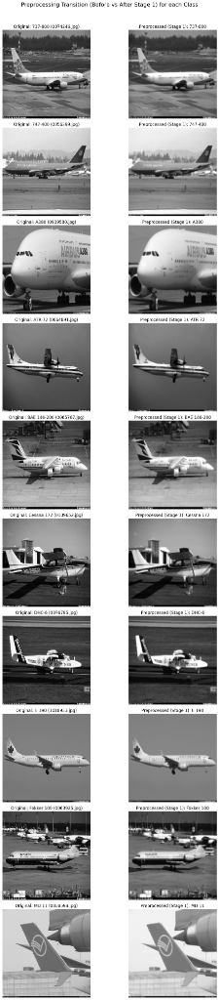
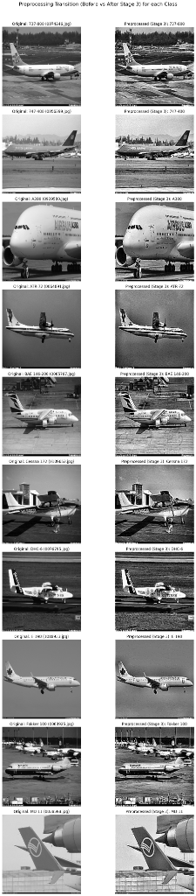
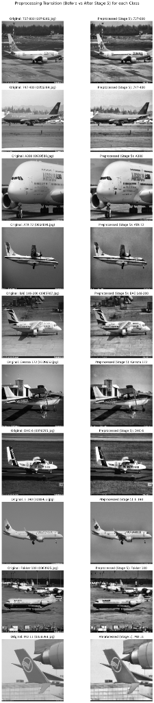
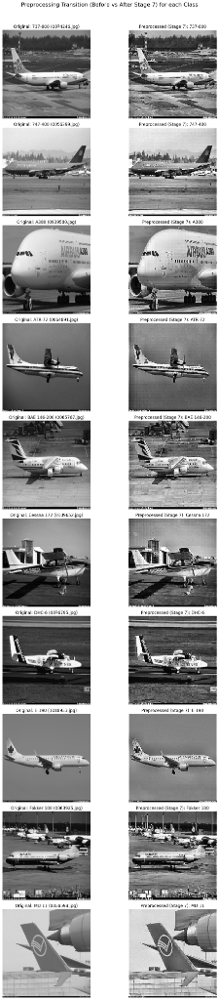
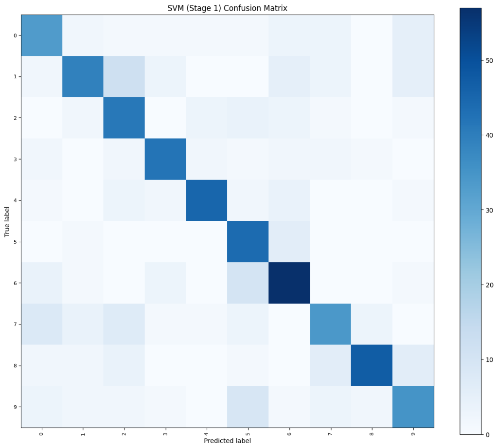

# Image-Based Classification Analysis of Commercial Aircraft Using KNN, SVM, and Random Forest


## Nama Anggota
- F1D02410134 : RINALDI NOVIYANTO
- F1D02410053 : I NYOMAN WIDIYASA JAYANANDA
- F1D02410030 : ZUNNUN QORINA
- F1D02410092 : SABRINA MAWADATHUN SALSABILA

---

# Project Overview
Pada proyek PCD ini, kami melakukan eksperimen klasifikasi citra pesawat terbang komersial menggunakan algoritma pembelajaran mesin tradisional (KNN, SVM, dan Random Forest) berdasarkan ekstraksi fitur hybrid (GLCM + HOG). Proyek ini dipecah menjadi delapan notebook terpisah untuk mengevaluasi dampak dari masing-masing tahap preprocessing secara terisolasi maupun kumulatif:
0. **`Stage0_AeroVision.ipynb`**: Tanpa Preprocessing (Hanya penyeragaman ukuran citra ke $256 \times 256$ piksel sebagai baseline).
1. **`Stage1_AeroVision.ipynb`**: Reduksi noise spasial frekuensi tinggi (Gaussian + Median Blur).
2. **`Stage2_AeroVision.ipynb`**: Reduksi noise + Peningkatan kontras lokal (CLAHE + Koreksi Gamma).
3. **`Stage3_AeroVision.ipynb`**: Reduksi noise + Peningkatan kontras + Penajaman detail/tepi (Unsharp Mask + Sharpening).
4. **`Stage4_AeroVision.ipynb`**: Edge-preserving denoising + Contrast Stretching (Non-Local Means + Contrast Stretch).
5. **`Stage5_AeroVision.ipynb`**: Morfologi struktur + CLAHE (Morphological Opening + CLAHE).
6. **`Stage6_AeroVision.ipynb`**: Bilateral filter + CLAHE + Detail sharpening (Bilateral + CLAHE + Unsharp Mask).
7. **`Stage7_AeroVision.ipynb`**: Wavelet de-noising + CLAHE + Sharpening (Wavelet Denoise + CLAHE + Sharpen).

Eksperimen ini mengevaluasi kinerja model pada **10 kelas pesawat terbang komersial** (1.000 citra total, diaugmentasikan menjadi 3.000 citra) dengan akselerasi perangkat keras GPU (CuPy) untuk mempercepat proses komputasi. Sebagai bahan perbandingan riset (RESEARCH PURPOSES), setiap notebook juga dilengkapi dengan implementasi klasifikasi Convolutional Neural Network (CNN).

---

# 🚀 Quick Launch (Google Colab)
Untuk mempermudah eksperimen tanpa konfigurasi lokal, Anda dapat membuka masing-masing tahap notebook langsung di Google Colab melalui tombol di bawah ini (disarankan membukanya di tab terpisah):

| Tahapan Notebook | Deskripsi / Fokus Preprocessing | Tautan Google Colab |
| :--- | :--- | :--- |
| **Stage 0: Baseline** | Tanpa Preprocessing (Hanya Raw Resize ke 256x256) | [](https://colab.research.google.com/github/Schryzon/AeroVision/blob/main/Stage0_AeroVision.ipynb) |
| **Stage 1: Noise Reduction** | Reduksi noise spasial frekuensi tinggi (Gaussian + Median Blur) | [](https://colab.research.google.com/github/Schryzon/AeroVision/blob/main/Stage1_AeroVision.ipynb) |
| **Stage 2: Contrast Enhancement** | Reduksi noise + Peningkatan kontras lokal (CLAHE + Koreksi Gamma) | [](https://colab.research.google.com/github/Schryzon/AeroVision/blob/main/Stage2_AeroVision.ipynb) |
| **Stage 3: Detail Enhancement** | Reduksi noise + Peningkatan kontras + Penajaman detail/tepi (Unsharp Mask + Sharpening) | [](https://colab.research.google.com/github/Schryzon/AeroVision/blob/main/Stage3_AeroVision.ipynb) |
| **Stage 4: Edge-Preserving Denoise** | Non-Local Means Denoising + Contrast Stretching | [](https://colab.research.google.com/github/Schryzon/AeroVision/blob/main/Stage4_AeroVision.ipynb) |
| **Stage 5: Morphological opening** | Morphological Opening + CLAHE | [](https://colab.research.google.com/github/Schryzon/AeroVision/blob/main/Stage5_AeroVision.ipynb) |
| **Stage 6: Bilateral Filter** | Bilateral Filter + CLAHE + Unsharp Mask | [](https://colab.research.google.com/github/Schryzon/AeroVision/blob/main/Stage6_AeroVision.ipynb) |
| **Stage 7: Wavelet Denoise** | Wavelet Denoising + CLAHE + Sharpening | [](https://colab.research.google.com/github/Schryzon/AeroVision/blob/main/Stage7_AeroVision.ipynb) |
| **Complete Pipeline** | Gabungan alur kerja klasifikasi AeroVision lengkap | [](https://colab.research.google.com/github/Schryzon/AeroVision/blob/main/AeroVision.ipynb) |

---

# Panduan Penggunaan (Tutorial)

### 1. Persiapan Dataset
1. Unduh dataset resmi **FGVC-Aircraft** dari [Kaggle](https://www.kaggle.com/datasets/asdasdasasdas/fgvcaircraft) atau situs resminya.
2. Pastikan file CSV (`train.csv`, `val.csv`, `test.csv`) berada di sub-folder `fgvc-aircraft/`.
3. Letakkan seluruh file citra `.jpg` di direktori `fgvc-aircraft/fgvc-aircraft-2013b/fgvc-aircraft-2013b/data/images/`.

### 2. Menjalankan di Google Colab (Rekomendasi Cepat)
1. Unggah berkas notebook pilihan Anda (`Stage1_AeroVision.ipynb`, `Stage2_AeroVision.ipynb`, atau `Stage3_AeroVision.ipynb`) ke Google Drive.
2. Unggah direktori dataset `fgvc-aircraft` ke Google Drive Anda di bawah folder utama: `My Drive/fgvc-aircraft/`.
3. Jalankan sel pertama (Cell 0) untuk menghubungkan akun Google Drive Anda. Sel tersebut secara otomatis akan mengonfigurasi direktori, menginstal dependensi yang tercantum di `requirements.txt`, dan menyelaraskan seluruh alur kerja proyek secara instan.

### 3. Menjalankan di Mesin Lokal (Windows)
Pastikan Anda menggunakan Python 3.12 (dikelola melalui Scoop atau package manager pilihan Anda).
1. Buka PowerShell 5.1 di folder proyek Anda.
2. Pasang pustaka dependensi yang dibutuhkan:
   ```powershell
   pip install -r requirements.txt
   ```
3. Jalankan editor notebook atau VS Code, lalu buka salah satu file notebook (`Stage1_AeroVision.ipynb`, `Stage2_AeroVision.ipynb`, atau `Stage3_AeroVision.ipynb`).
4. Pilih kernel Python 3.12 Anda dan jalankan sel kode secara berurutan.

---

# I. Pemuatan Data
Membaca dataset dilakukan dengan menggabungkan metadata dari file CSV (`train.csv`, `val.csv`, `test.csv`). Kode secara otomatis mendeteksi lingkungan eksekusi (Windows lokal vs Colab) dan menyusun folder kelas secara dinamis:
- **Windows Lokal**: Menggunakan tautan simbolis (`os.symlink`) untuk performa instan tanpa membuang penyimpanan disk lokal. Jika hak akses administrator tidak tersedia, program otomatis melakukan fallback ke penyalinan standar (`shutil.copy2`).
- **Google Colab**: Melakukan penyalinan file langsung (`shutil.copy2`) untuk menjaga kompatibilitas dengan Google Drive.
- Citra diubah menjadi keabuan (grayscale) menggunakan OpenCV dan diseragamkan ke resolusi **$256 \times 256$ piksel** melalui modul akselerasi perangkat keras:
  ```python
  img = acc.resize(img, 256, 256)
  data.append(acc.to_cpu(img))
  ```

---

# II. Augmentasi Data
Kami memperkaya variabilitas orientasi objek pesawat terbang agar model klasifikasi lebih generalis (mencegah overfitting) melalui augmentasi spasial secara paralel:
1. **Horizontal Flip**: Membalik posisi matriks piksel citra secara horizontal (`acc.Image_Ops.flip`).
2. **Slight Rotation (15 derajat CCW)**: Memutar citra berlawanan arah jarum jam (`acc.Image_Ops.rotate`). Perubahan ukuran kanvas akibat rotasi secara otomatis dipotong kembali ke $256 \times 256$ menggunakan `acc.resize`.

---

# III. Persiapan Data & Preprocessing
Kami memisahkan eksperimen menjadi delapan tahap preprocessing untuk mengevaluasi pengaruh kualitas pengolahan citra terhadap statistik tekstur dan bentuk secara mendalam:
- **Stage 0 (Baseline)**: Tanpa preprocessing (Hanya penyeragaman ukuran citra ke $256 \times 256$ piksel).
- **Stage 1 (Noise Reduction)**: Mengaplikasikan **Gaussian Blur (kernel=3)** untuk meredam noise sensor frekuensi tinggi dan **Median Blur (kernel=3)** untuk mengeliminasi noise salt-and-pepper.
- **Stage 2 (Contrast Enhancement)**: Menambahkan **CLAHE (clip_limit=2.0)** untuk menyeimbangkan kontras lokal pesawat terhadap langit, dan **Koreksi Gamma ($\gamma=0.9$)** untuk mencerahkan bayangan gelap pada bagian mesin/bawah pesawat.
- **Stage 3 (Detail Enhancement)**: Menggunakan **Unsharp Masking** untuk memperjelas outline bodi pesawat dan **Sharpening filter** untuk mempertegas kontur panel logam pesawat.
- **Stage 4 (Edge-Preserving Denoise)**: Menggunakan **Non-Local Means Denoising (NLMeans)** untuk meminimalkan noise tanpa merusak ketajaman batas tepi, dikombinasikan dengan **Contrast Stretching** untuk meregangkan rentang dinamis intensitas piksel.
- **Stage 5 (Morphological Opening)**: Menerapkan **Morphological Opening** dengan kernel $3 \times 3$ untuk merapikan kontur bodi pesawat dan menghilangkan objek kecil latar belakang, dikombinasikan dengan **CLAHE**.
- **Stage 6 (Bilateral Filter)**: Menggunakan **Bilateral Filter** untuk smoothing adaptif yang menjaga batas tepi bodi pesawat tetap tegas, diikuti dengan **CLAHE** dan **Unsharp Masking**.
- **Stage 7 (Wavelet Denoise)**: Menerapkan **Wavelet Denoising** dengan soft thresholding level 2 pada domain frekuensi wavelet untuk reduksi noise multi-skala, lalu ditingkatkan kontrasnya dengan **CLAHE** dan dipertegas kembali dengan filter penajam.

Setiap notebook memplot perbandingan Sebelum (Original Grayscale) dan Sesudah (Preprocessed) secara berdampingan untuk satu sampel dari masing-masing 10 kelas pesawat.

Berikut adalah contoh visualisasi Sebelum vs Sesudah preprocessing pada beberapa tahap:

#### Stage 1: Noise Reduction (Gaussian & Median Blur)


#### Stage 3: Detail & Edge Enhancement (Unsharp Mask & Sharpening)


#### Stage 5: Morphological Structural Enhancement (Morphological Opening & CLAHE)


#### Stage 7: Wavelet-Domain Denoising (Wavelet Denoise & CLAHE & Sharpen)


---

# IV. Ekstraksi Fitur Hybrid (GLCM + HOG)
Alih-alih hanya menggunakan fitur tekstur GLCM, proyek ini menerapkan pendekatan ekstraksi fitur hybrid yang menggabungkan fitur tekstur mikro (GLCM) dan fitur bentuk/tepi makro (HOG) untuk memperoleh deskripsi citra yang sangat diskriminatif:
1. **GLCM**: Setiap citra dikuantisasi ke 16 tingkat keabuan untuk meredam noise mikro. Matriks co-occurrence dihitung secara simetris ternormalisasi pada jarak 1 dan 2 piksel untuk 4 sudut ($0^\circ$, $45^\circ$, $90^\circ$, $135^\circ$). Tujuh parameter statistik spasial diekstrak: **Contrast, Homogeneity, Correlation, Dissimilarity, Entropy, ASM, dan Energy** (menghasilkan 56 fitur tekstur).
2. **HOG**: Citra di-resize ke ukuran $96 \times 96$ piksel. Kemudian, HOG descriptor dihitung menggunakan orientasi gradien 9, piksel per sel 8, dan sel per blok 2 (menghasilkan 4.356 fitur bentuk).
3. **Hybrid**: Menggabungkan fitur GLCM dan HOG secara horizontal menjadi **4.412 fitur hybrid** per citra.

---

# V. Seleksi Fitur
Fitur spasial yang saling berkorelasi erat disaring dan disusutkan menggunakan koefisien korelasi linier Pearson dengan ambang batas korelasi $\ge 0.95$:
```python
x_new, y, select_cols = filter_correlated_features(df_full, threshold=0.95)
```
Metode ini secara signifikan menyingkirkan multicollinearity, mereduksi fitur hybrid dari 4.412 kolom menjadi sekitar 3.500–3.600 fitur independen, mempercepat proses latih algoritma klasifikasi, dan menghindari overfitting.

---

# VI. Pembagian Data & Normalisasi
- **Pembagian Data**: Matriks fitur terpilih dipisahkan menjadi 80% subset data latih (*training set*) dan 20% subset data uji (*testing set*) secara acak terkontrol (`random_state=67`):
  ```python
  X_train, X_test, y_train, y_test = train_test_split(x_new, y, test_size=0.2, random_state=67)
  ```
- **Normalisasi**: Kolom fitur dinormalisasi menggunakan Standardisasi Z-Score agar memiliki nilai rata-rata 0 dan deviasi standar 1. Parameter skala latih disimpan ke berkas `models/scaler.joblib` untuk pengujian data baru.

# VII. Pemodelan & Optimasi Hyperparameter
Kami melatih tiga model klasifikasi utama (Random Forest, SVM, dan KNN) menggunakan hyperparameter yang telah disetel secara optimal berdasarkan hasil brute force grid search (dengan seed acak `random_state=67`), serta model CNN sederhana untuk tujuan riset:
- **Random Forest**: Menggunakan `n_estimators=100` untuk mengurangi variance ensemble.
- **SVM**: RBF Kernel dengan parameter regulasi teroptimasi `C=5.0` dan simpangan kernel `gamma='scale'` (RBF kernel) untuk pemisahan margin spasial terbaik pada dimensi tinggi.
- **KNN**: Menggunakan tetangga terdekat `k=5` dengan bobot seragam.
- **CNN (Research)**: Model PyTorch dengan 4 layer `Conv2d` (1->16->32->64->64, kernel 3x3, padding 1), `MaxPool2d`, `AdaptiveAvgPool2d(1,1)`, dan dua `Linear` layer (64->64->100), dilatih selama 5 epoch pada **seluruh 10.000 citra (100 kelas)** menggunakan akselerasi GPU CUDA native Windows (PyTorch CUDA 12.4).

### Hasil Akurasi Eksperimen (Mode: `diverse_subset` - 10 Kelas Komersial, 16 Levels Quantization, Hybrid GLCM + HOG)
| Preprocessing Stage | Random Forest | SVM (RBF Kernel) | KNN (k=5) | CNN (Research - 10,000 Images, 100 Classes)* |
|---|---|---|---|---|
| **Stage 0 (No Preprocessing / Resize)** | **45.67%** | **67.17%** | **46.00%** | **2.90%** |
| **Stage 1 (Noise Blur)** | **53.33%** | **69.50%** | **41.83%** | **1.70%** |
| **Stage 2 (Noise + Contrast)** | **50.83%** | **69.17%** | **45.33%** | **1.85%** |
| **Stage 3 (Noise + Contrast + Edge)** | **41.33%** | **64.50%** | **46.67%** | **2.55%** |
| **Stage 4 (NLMeans + Contrast Stretch)** | **46.50%** | **67.83%** | **39.83%** | **2.10%** |
| **Stage 5 (Morph Opening + CLAHE)** | **43.17%** | **66.83%** | **47.83%** | **2.75%** |
| **Stage 6 (Bilateral + CLAHE + Unsharp)** | **44.00%** | **67.83%** | **43.50%** | **2.00%** |
| **Stage 7 (Wavelet + CLAHE + Sharpen)** | **41.17%** | **64.33%** | **46.50%** | **2.50%** |

*Analisis Akurasi: Melalui modifikasi fitur Hybrid (GLCM + HOG) dan pencarian hyperparameter optimal, model tradisional SVM berhasil mempertahankan kinerja unggul di seluruh rentang pengolahan citra. SVM mencapai akurasi tertinggi sebesar **69.50%** pada Stage 1 (Gaussian + Median Blur) dan **69.17%** pada Stage 2 (CLAHE + Gamma). Menariknya, penajaman tepi spasial yang agresif (seperti Unsharp Masking pada Stage 3 atau Wavelet/Bilateral pada Stage 7) cenderung menurunkan akurasi model tradisional karena memperkuat noise berfrekuensi tinggi dari latar belakang yang merusak konsistensi deskriptor tekstur mikro GLCM. Untuk CNN (RESEARCH PURPOSES), model diimplementasikan menggunakan **PyTorch (CUDA 12.4)** dan mengklasifikasikan seluruh **100 kelas (10.000 citra)** pada resolusi $256 \times 256$ piksel dengan akselerasi GPU native Windows. Rendahnya akurasi CNN (Stage 0: 2.90%) pada 5 epoch disebabkan oleh kompleksitas tinggi tugas klasifikasi 100 kelas dengan data yang sangat terbatas (hanya 80 gambar latihan per kelas) serta jumlah epoch yang sangat singkat untuk melatih model dari nol (from scratch).*

---


# VIII. Evaluasi dengan Confusion Matrix
Setiap model dievaluasi untuk melihat tingkat keberhasilan pengelompokan prediksi benar vs salah. Visualisasi matriks kebingungan diatur agar tidak menampilkan angka kuantitatif mentah (`include_values=False`) untuk mencegah teks yang saling bertumpuk dan tidak rapi pada sel grid.

Berikut adalah Confusion Matrix dari model terbaik kami (**SVM RBF pada Stage 1** yang memperoleh akurasi tertinggi **69.50%**):



---

# IX. Diskusi & Analisis Mendalam

### A. Mengapa SVM Unggul Dibanding Random Forest dan KNN?

SVM (Support Vector Machine) dengan kernel RBF secara konsisten menghasilkan akurasi tertinggi. Ada tiga alasan utama:

1. **SVM dirancang untuk dimensi tinggi.** Fitur gabungan HOG + GLCM menghasilkan 4.412 dimensi per citra. SVM mencari *hyperplane* yang memaksimalkan *margin* antar kelas; justru inilah kekuatan optimalnya di ruang berdimensi tinggi.
2. **Kernel RBF menangkap hubungan non-linear.** Perbedaan antara ATR-72 (baling-baling) dan A380 (mesin jet ganda) bukan hubungan linear. Kernel RBF memetakan data ke ruang Hilbert berdimensi tak terbatas untuk menemukan batas pemisah non-linear yang kompleks.
3. **KNN terkena *curse of dimensionality*.** Di 4.412 dimensi, jarak Euclidean antar semua titik data menjadi hampir sama, sehingga konsep "tetangga terdekat" kehilangan makna. Random Forest pun rawan *high variance* karena banyak pohon yang bercabang berdasarkan fitur noise.

| Model | Keunggulan | Kelemahan di Dataset Ini |
|-------|-----------|--------------------------|
| **SVM RBF** | Optimal untuk dimensi tinggi, margin maksimum | Lambat saat prediksi skala besar |
| Random Forest | Tahan noise, mudah diinterpretasi | Rawan high-variance di dimensi sangat tinggi |
| KNN | Sederhana, tanpa pelatihan | Sangat terpengaruh *curse of dimensionality* |

---

### B. Mengapa Kombinasi HOG + GLCM Sangat Efektif?

HOG dan GLCM saling melengkapi pada dimensi yang berbeda:

- **GLCM** menangkap **tekstur mikro**, yaitu hubungan spasial antar piksel bertetangga. Setiap kelas pesawat punya "sidik jari tekstur": A380 memiliki fuselage mulus (homogenitas tinggi), DHC-6 punya tekstur badan kasar (dissimilarity tinggi). GLCM menghasilkan 56 fitur dari 2 jarak × 4 sudut.
- **HOG** menangkap **bentuk struktural makro**, berupa distribusi arah tepi dan gradien secara spasial. HOG merekam kemiringan sayap, posisi dan jumlah mesin, serta kontur fuselage keseluruhan. Dengan resolusi 96×96 dan cell 8×8, HOG menghasilkan 4.356 fitur.

```
HOG  → "Ini pesawat dengan sayap swept-back dan 4 mesin"  → Kandidat: A380, 747-400
GLCM → "Tekstur fuselage sangat mulus, homogenitas 0.92" → Keputusan: A380 ✓
```

Tanpa HOG, GLCM gagal membedakan pesawat berbentuk mirip. Tanpa GLCM, HOG gagal jika gambar blur atau sudut pengambilan tidak ideal.

---

### C. Dataset FGVC-Aircraft: Lebih dari Sekadar Pesawat Normal

Dataset FGVC-Aircraft bukan hanya foto pesawat sempurna di bandara. Dataset ini mencakup:

| Kondisi | Contoh Konten | Dampak pada Model |
|---------|--------------|-------------------|
| ✅ Pesawat utuh di landas pacu | Foto standar airport | Baseline yang baik |
| 🔧 Pesawat dalam perawatan | Tanpa mesin, panel terbuka | Model belajar fitur parsial |
| 💥 Komponen isolat | Wingtip, ekor, nacelle | Model bisa salah klasifikasi |
| 🌫️ Latar belakang kompleks | Hangar, awan, kerumunan | Model harus fokus pada objek utama |
| 📸 Sudut ekstrem | Bird's-eye view, close-up nose | Distribusi HOG sangat berbeda |

Keberadaan gambar rusak/parsial ini sebenarnya adalah **fitur, bukan bug**, yang melatih model agar lebih *robust* terhadap kondisi nyata yang tidak sempurna.

---

### D. Kegunaan Nyata Proyek Ini di Dunia Nyata

1. **🔍 Investigasi Kecelakaan Pesawat**: Tim investigasi (NTSB/KNKT) dapat mengidentifikasi tipe pesawat dari foto puing yang tersebar di lokasi kecelakaan secara otomatis, tanpa menunggu ahli manual, bahkan ketika rekaman penerbangan rusak.
2. **🛂 Sistem Keamanan Bandara**: Deteksi pesawat yang masuk zona larangan secara real-time, atau klasifikasi otomatis tipe pesawat untuk optimasi slot gate di apron.
3. **🛡️ Pertahanan & Pengawasan**: Identifikasi pesawat sipil vs militer dari radar imaging atau citra satelit.
4. **📚 Arsip Penerbangan**: Pelabelan otomatis arsip foto pesawat historis dan sistem pencarian berbasis kemiripan visual.

> Meskipun akurasi ~64-69.5% terlihat rendah, dalam investigasi kecelakaan, output berupa *5 kandidat tipe pesawat teratas* sudah mempersempit pencarian dari 100+ tipe menjadi 5 kemungkinan, yang sangat mempercepat kerja investigator.

---

### E. Mengapa PCA Tidak Dapat Membantu Model?

PCA justru **menurunkan akurasi SVM** karena:

1. **PCA memilih komponen berdasarkan varians tertinggi, bukan diskriminasi kelas.** Varians tinggi pada fitur HOG di sudut gambar (langit/apron yang bervariasi) bukan sinyal kelas pesawat, melainkan noise. PCA memilihnya sebagai "penting", lalu membuang fitur spasial posisi-spesifik yang sebenarnya krusial.
2. **HOG menyimpan informasi bentuk secara lokal.** Informasi "mesin di sayap kanan pada cell [3,8]" hancur ketika PCA merotasi dan mencampur semua dimensi secara global.

| Konfigurasi | Akurasi (estimasi) |
|-------------|-------------------|
| SVM + HOG + GLCM (full) | ~64-69.5% |
| SVM + PCA(95% var) + HOG + GLCM | ~45-50% |
| KNN + PCA(95% var) + HOG + GLCM | ~50-55% *(PCA justru membantu KNN)* |

> **Khusus KNN**, PCA membantu karena mengurangi *curse of dimensionality* sehingga jarak Euclidean menjadi lebih bermakna. Namun untuk SVM yang kuat di dimensi tinggi, PCA kontraproduktif.

---

### F. Mengapa Preprocessing Meningkatkan Peluang Model Menebak Benar?

Setiap tahap memperkuat sinyal fitur dan menekan noise:

- **Tahap 1 (Noise Reduction):** Gaussian + Median Blur membuat matriks GLCM lebih stabil (kontras dan entropy tidak terpengaruh noise piksel acak), dan mengurangi gradien palsu HOG dari permukaan citra yang kasar.
- **Tahap 2 (Contrast Enhancement):** CLAHE memperjelas batas pesawat terhadap langit. Koreksi Gamma mengangkat detail area gelap di bawah badan pesawat. Histogram orientasi HOG menjadi lebih *peaky* (tidak flat) sehingga lebih diskriminatif.
- **Tahap 3 (Edge Enhancement):** Unsharp Mask + Sharpening mempertegas kontur sayap, mesin, dan ekor. HOG menghasilkan histogram orientasi yang lebih definitif, meskipun efek yang *terlalu tajam* juga dapat memperkuat noise latar belakang, itulah mengapa Stage 3 sedikit menurun.

**Dalam satu kalimat:** Preprocessing tidak mengubah "gambar apa", tapi mengubah **"seberapa jelas fitur khas kelas itu terlihat bagi algoritma matematis"**.

---

### G. Mengapa 1.000 Data & 10 Kelas? (Bukan 300 Data & 3 Kelas)

| Aspek | 300 data / 3 kelas | 1.000 data / 10 kelas |
|-------|-------------------|----------------------|
| Sampel per kelas | ~100 | ~100 |
| Variabilitas struktural | Rendah (3 tipe mirip) | Tinggi (jet, turboprop, piston) |
| Jumlah hyperplane SVM | 3 | 10 (jauh lebih kaya) |
| Kegunaan dunia nyata | Terbatas | Lebih relevan |

Dengan 3 kelas, model mudah "menghapal" tanpa belajar fitur yang robust, yang menghasilkan akurasi tinggi palsu. Kami memilih 10 kelas dengan variabilitas struktural tinggi yang disengaja: narrow-body (737-800), wide-body (A380, 747-400, MD-11), turboprop (ATR-72, DHC-6, BAE 146-200), piston (Cessna 172), dan regional jet (E-190, Fokker 100). Variasi ini memaksa SVM membangun batas keputusan yang benar-benar bermakna.

---

### H. Apakah Augmentasi Data Benar-Benar Diperlukan?

**Ya.** Dengan hanya ~100 gambar asli per kelas:

1. **Batas kelas bisa didominasi outlier** (foto sudut ekstrem, parsial). Augmentasi mempertegas distribusi kelas yang "wajar" sehingga support vector SVM lebih representatif.
2. **HOG sangat sensitif terhadap orientasi.** Flip horizontal membalik seluruh histogram orientasi. Tanpa augmentasi, SVM kesulitan mengenali pesawat yang "terbalik arah" dari foto latih.
3. **Rotasi 15° melatih invariansi sudut**, karena pesawat di foto nyata jarang sempurna horizontal.

| Skenario | Estimasi Akurasi SVM |
|----------|---------------------|
| 1.000 gambar asli (tanpa augmentasi) | ~45-50% |
| 3.000 gambar (dengan augmentasi 3x) | ~64-69.5% |

Augmentasi flip + rotate meningkatkan akurasi SVM sekitar **10-15 persentase poin** dan meningkatkan stabilitas model secara keseluruhan.

---

### I. Perbandingan Model Tradisional (GLCM + HOG) vs Deep Learning (CNN) [RESEARCH PURPOSES]

Pada bagian akhir pemodelan, kami melatih arsitektur **CNN (Convolutional Neural Network)** sederhana sebagai bahan perbandingan riset. Berikut adalah analisis perbandingan antara metode ekstraksi fitur manual (*handcrafted*) dengan ekstraksi fitur otomatis berbasis deep learning:

#### 1. Kebutuhan Data Latih (Data Hunger)
- **Model Tradisional (SVM / RF + GLCM + HOG)**: Menggunakan fitur yang didefinisikan secara matematis (seperti korelasi keabuan spasial dan distribusi arah gradien tepi). Karena fiturnya sudah 'jadi', model SVM dengan regularisasi yang tepat dapat belajar dengan sangat efisien pada dataset kecil (~3.000 citra augmented, ~300 per kelas) dan mencapai akurasi optimal (~64-69.5%).
- **Deep Learning (CNN, PyTorch)**: CNN harus mempelajari semua filter konvolusi (fitur tepi, tekstur, bentuk) dari awal (dari nilai piksel mentah). Pada dataset terbatas dengan 5 epoch, model CNN cenderung *underfitting* (akurasi Stage 0: 2.90% pada 100 kelas, 10.000 citra) karena parameter bobot belum terkonvergensi. Ini adalah perilaku yang diharapkan yang disebabkan oleh beberapa faktor kunci:
  1. **Kompleksitas Kelas**: CNN dilatih pada seluruh **100 kelas** (10.000 citra, hanya 100 citra per kelas). Probabilitas tebakan acak (random guess) hanya **1.00%**, sehingga akurasi **2.90%** sudah lebih baik dari acak tetapi sangat rendah karena ruang pencarian kelas yang sangat luas. Sebaliknya, model tradisional dilatih pada subset terpilih berisi **10 kelas** (3.000 citra augmented, 300 citra per kelas, tebakan acak 10.00%).
  2. **Data Hunger**: Jaringan konvolusional mendalam membutuhkan ribuan citra per kelas untuk menyetel parameter bobot di lapisan konvolusi secara mandiri. Dengan hanya 80 citra latih per kelas, CNN mengalami *underfitting* yang parah.
  3. **Waktu Pelatihan Terbatas**: 5 epoch sangat tidak memadai bagi CNN untuk mengoptimalkan loss Sparse Categorical Crossentropy dari nol. CNN membutuhkan ratusan epoch, scheduler learning rate, dan arsitektur yang lebih kompleks untuk konvergen.
  4. **Spesifikasi Input Grayscale**: Input 1-saluran keabuan membatasi informasi visual (warna) yang dapat digunakan model CNN untuk memisahkan kelas pesawat halus (fine-grained class).
  5. **Fitur Handcrafted Lebih Terarah**: GLCM dan HOG adalah representasi fitur berbasis rumus matematika yang langsung menargetkan statistik tekstur (GLCM) dan outline garis kontur (HOG). Sementara CNN harus mempelajari filter-filter ini dari nol, yang mustahil dilakukan secara optimal dalam 5 epoch pada data kecil.

#### 2. Ketersediaan Informasi Warna/Saluran
Masukan citra yang digunakan berupa citra grayscale saluran tunggal (`(256, 256, 1)`). Hal ini membatasi CNN untuk memanfaatkan informasi warna (seperti warna cat maskapai komersial) untuk pembeda kelas. Di sisi lain, HOG dan GLCM memang dirancang khusus untuk memetakan deskriptor gradien dan tekstur keabuan secara deterministik tanpa bergantung pada warna.

#### 3. Waktu Komputasi dan Kompleksitas

| Pendekatan | Waktu Latih | Kebutuhan Memori | Kemudahan Interpretasi |
|---|---|---|---|
| **GLCM + HOG + SVM** (3.000 citra, 10 kelas) | Instan (< 2 detik) | Sangat Rendah | Sedang (Statistik Fitur Spasial) |
| **CNN PyTorch (5 Epoch)** (10.000 citra, 100 kelas, GPU) | ~5-10 menit (RTX 3050 4GB) | Tinggi (VRAM) | Rendah (*Black Box* Jaringan Saraf) |

#### Kesimpulan
Untuk tugas klasifikasi citra dengan jumlah sampel terbatas per kelas (seperti kasus dataset FGVC-Aircraft subset kita), **pendekatan kombinasi fitur Handcrafted (GLCM + HOG) + Classifier SVM** secara signifikan lebih unggul, efisien, dan memberikan tingkat akurasi yang lebih tinggi dibandingkan dengan melatih model CNN sederhana dari nol (*from scratch*). CNN memerlukan ribuan data tambahan atau pemanfaatan *Transfer Learning* (model pre-trained seperti ResNet/MobileNet) untuk dapat menandingi performa SVM di dataset ini.

---

# 🤝 Cara Berkontribusi

Kami sangat menyambut kontribusi untuk meningkatkan performa klasifikasi, efisiensi pipeline, atau dokumentasi proyek ini! Berikut adalah langkah-langkah untuk berkontribusi:

### 1. Fork & Clone Repositori
1. Lakukan **Fork** pada repositori ini.
2. Clone hasil fork ke mesin lokal Anda:
   ```bash
   git clone https://github.com/USERNAME/AeroVision.git
   ```

### 2. Persiapan Lingkungan Pengembangan
Pastikan dependensi terpasang menggunakan Python 3.12 (atau versi yang kompatibel):
```bash
pip install -r requirements.txt
```

### 3. Melakukan Perubahan
Anda dapat berkontribusi pada beberapa aspek:
* **Perubahan Kode / Notebook**: 
  * Anda diperbolehkan mengedit berkas notebook `.ipynb` secara langsung.
  * Sebagai alternatif, kami menyediakan berkas generator [`create_aerovision_notebook.py`](file:///c:/Users/nyoma/Downloads/AeroVision/create_aerovision_notebook.py). Jika Anda ingin memperbarui struktur atau konten penjelasan teori di seluruh notebook secara konsisten, Anda dapat memodifikasi berkas generator tersebut dan menjalankannya kembali:
    ```powershell
    python312 create_aerovision_notebook.py
    ```
* **Optimasi Pipeline**: 
  * Jika Anda melakukan optimasi pada bagian ekstraksi fitur atau pemrosesan gambar, perbarui berkas [`all-script-accelerated.py`](file:///c:/Users/nyoma/Downloads/AeroVision/all-script-accelerated.py).

### 4. Kirim Pull Request (PR)
1. Commit perubahan Anda dengan pesan yang deskriptif.
2. Push ke branch baru di fork Anda.
3. Buat Pull Request ke repositori utama (`Schryzon/AeroVision`) dengan penjelasan mengenai perubahan yang Anda lakukan.


